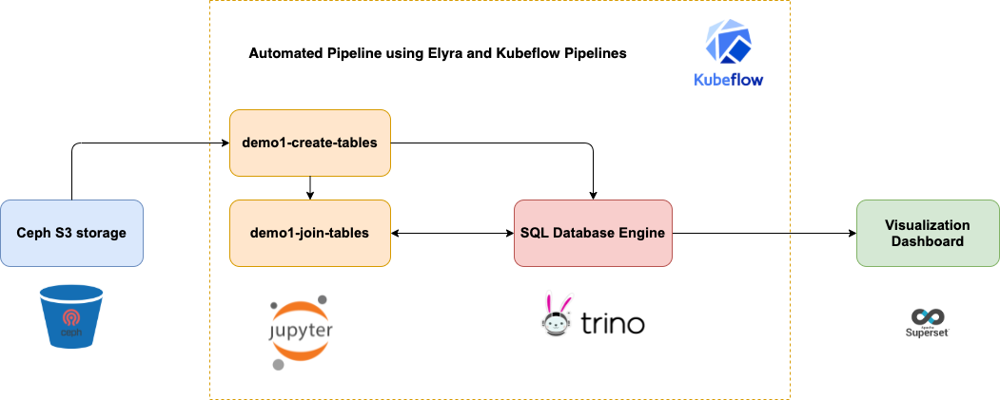
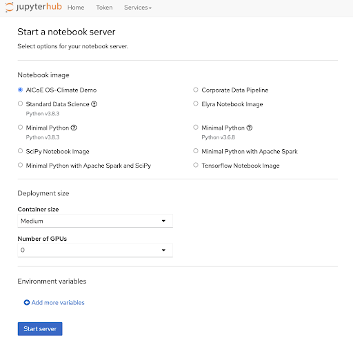
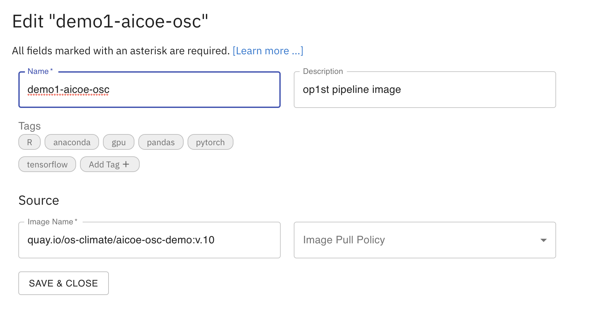
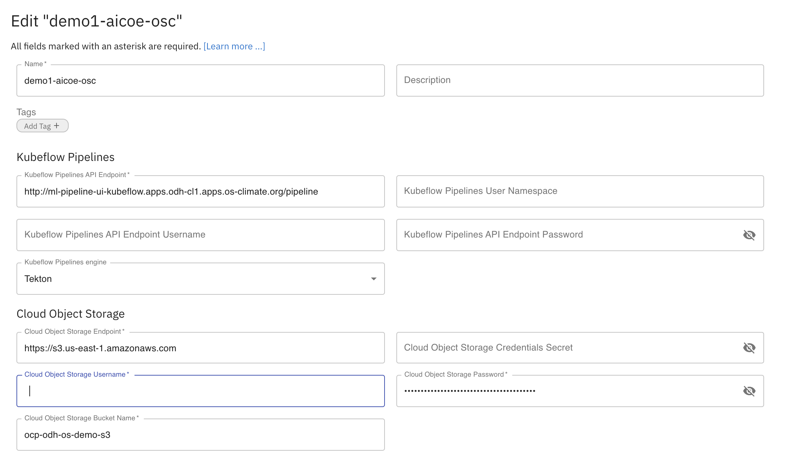
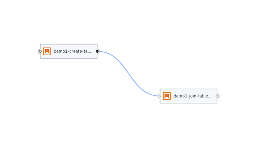
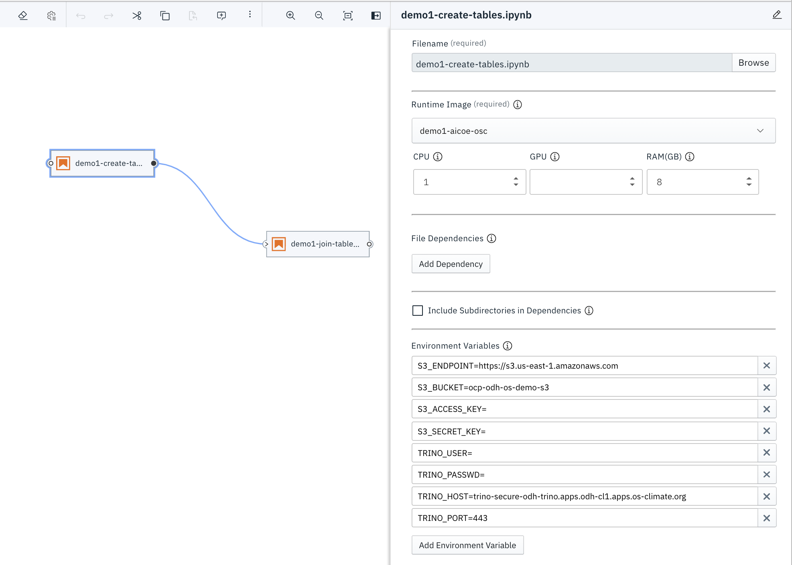
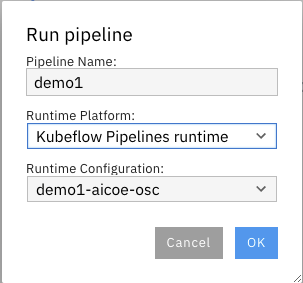

# Demo 1 - ETL and Visualizations with Open Data Hub

This demo consists of jupyter notebook, an elyra pipeline and a Superset Dashboard that provides an example of how to use the tools available within [Open Data Hub](https://opendatahub.io/) on an [Operate First](https://www.operate-first.cloud/) cluster to perform ETL and create interactive dashboards and visualizations of our data.

Above is a flowchart which demonstrates the workflow followed for this demo. Before jumping into the workflow for recreating this Demo, let’s first take a look at some pre-requisites that are needed to create an initial setup.

[Here](https://youtu.be/TFgsR7UlcHA) is a video that goes over the workflow followed in detail.

## Initial Setup

* In order to access the environment for the development of the project, you will have to be added to the odh-env-users group [here](https://github.com/orgs/os-climate/teams/odh-env-users). This can be done by opening an issue on [this page](https://github.com/os-climate/aicoe-osc-demo/issues) with the title "Add <USERNAME> to odh-env-users".

* Once added to the user’s list, you would be able to access [JupyterHub](https://jupyterhub-odh-jupyterhub.apps.odh-cl1.apps.os-climate.org), Kubeflow [Pipelines](http://ml-pipeline-ui-kubeflow.apps.odh-cl1.apps.os-climate.org/), [Trino](https://cloudbeaver-odh-trino.apps.odh-cl1.apps.os-climate.org/), and the [Superset Dashboard](https://superset-secure-odh-superset.apps.odh-cl1.apps.os-climate.org/).

* After logging into JupyterHub, select the `AICoE OS-Climate Demo` image to get started with the project.

* Make sure you add the credentials file to the root folder of the project repository. For more details on how to set up your credentials, and retrieve your JWT token to access Trino, refer to the documentation given [here](https://github.com/os-climate/os_c_data_commons/blob/main/docs/setup-initial-environment.md#4-set-your-credentials-environment-variables).

* To install the dependencies needed for running the notebooks, you can run a `pipenv install` at the root of the repository or use the [Horus](https://github.com/thoth-station/jupyterlab-requirements/blob/dc92a4b14f539e6f464b3f202355242b4f729e13/docs/source/horus-magic-commands.md) magic commands from within the notebook.

## Data Collection and Processing

1. In the [demo1-create-tables jupyter notebook](./demo1-create-tables.ipynb), we start by collecting raw data and ingesting it into Trino.

2. In the [demo1-join-tables jupyter notebook](./demo1-join-tables.ipynb), we run a join against a different federated data table and ingest it into Trino.

## ML Pipeline

To run the two notebooks in a sequential and automated fashion, we use Elyra notebook pipelines editor and kubeflow pipelines to ensure the workflow is automated.

You can access the saved Elyra Pipeline [here](./demo1.pipeline).

### Setup Kubeflow Pipelines

* To run the pipeline, you will need the Elyra notebook pipeline editor. Make sure you are on the `Elyra Notebook Image` or the `AICOE-OSC OS Climate Demo` image on the OS-Climate [JupyterHub](https://jupyterhub-odh-jupyterhub.apps.odh-cl1.apps.os-climate.org/)

* To get a Kubeflow pipeline running, you need to create a runtime image and a kubeflow pipelines runtime configuration.

#### Add runtime images

To create a runtime image using Elyra, follow the steps given [here](https://github.com/AICoE/elyra-aidevsecops-tutorial/blob/master/docs/source/create-ai-pipeline.md#add-runtime-images-using-ui).

Fill all required fields to create a runtime image for the project repo:

- Name: `demo1-aicoe-osc`
- Image Name: `quay.io/os-climate/aicoe-osc-demo:v.10`

#### Add Kubeflow Pipeline runtime configuration

To create a kubeflow pipeline runtime configuration image using Elyra, follow the steps given [here](https://github.com/AICoE/elyra-aidevsecops-tutorial/blob/master/docs/source/create-ai-pipeline.md#create-runtime-to-be-used-in-kubeflow-pipeline-using-ui).

Insert all inputs for the Runtime"
- Name: `demo1-aicoe-osc`
- Kubeflow Pipeline API Endpoint: `http://ml-pipeline-ui-kubeflow.apps.odh-cl1.apps.os-climate.org/pipeline`
- Kubeflow Pipeline Engine: `Tekton`
- Cloud Object Storage Endpoint: `S3_ENDPOINT`
- Cloud Object Storage Username: `S3_ACCESS_KEY`
- Cloud Object Storage Password: `S3_SECRET_KEY`
- Cloud Object Storage Bucket Name: `S3_BUCKET`

#### Set up Notebook Properties

There is a pre-existing Elyra Pipeline that has been setup for this demo called `demo1.pipeline`.

To trigger this pipeline, you need to make sure that the node properties for each notebook have been updated.

You need to fill in the cloud object storage bucket credentials like `S3_ENDPOINT`, `S3_ACCESS_KEY`, `S3_SECRET_KEY`, `S3_BUCKET`, and the Trino database access credentials like `TRINO_USER`, `TRINO_PASSWD`, `TRINO_HOST`, `TRINO_PORT`

#### Run Pipeline

Once your pipeline is set up, you can run the pipeline by hitting the run button on the top left of the pipeline. You can give it a name and select the previously created Kubeflow Pipelines Runtime Configuration from the dropdown.

## Visualization

After collecting the data and ingesting it into Trino, we would want to visualize various metrics that provide insights for the fetched data. We use Apache Superset [Dashboards](https://superset-secure-odh-superset.apps.odh-cl1.apps.os-climate.org/superset/dashboard/3/) to visualize these metrics.

To learn how to use Trino and Superset in order to add more visualizations, you can follow the guide [here](https://www.operate-first.cloud/users/support/docs/trino_superset_user_guide.md#trino-to-superset).
